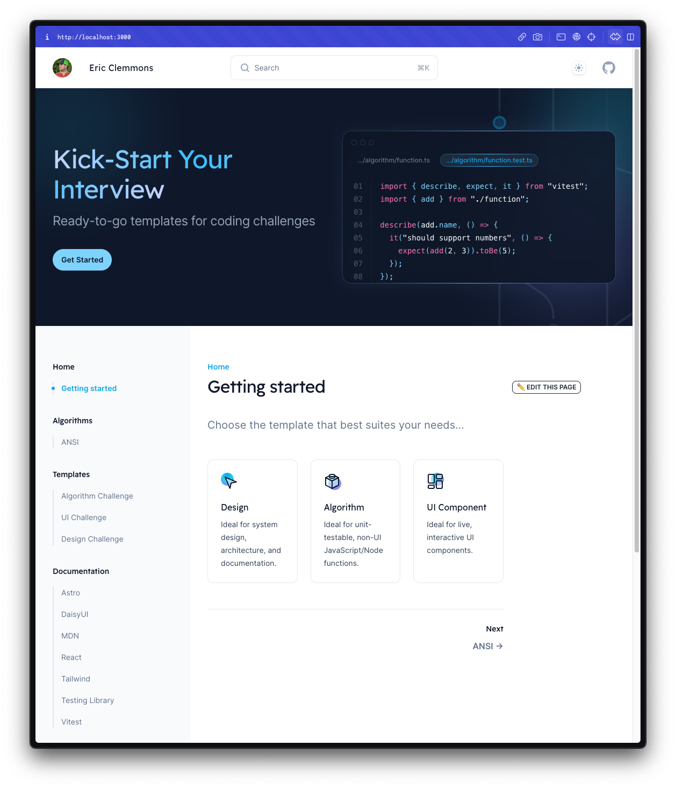

# Tech Screen Template

> Interviews are stressful and the anxiety to perform well is **high**.
>
> While some companies still use tools like [CoderPad](https://coderpad.io/) or Google Docs 🤢, many are encouraging candidates to **B**ring **Y**our **O**wn **E**nvironment.
>
> Rather than starting with a vanilla clone of [Create React App](https://create-react-app.dev/), **this template is designed to give you a [Home advantage](https://en.wikipedia.org/wiki/Home_advantage)** with all the familiar tools, keyboard shortcuts, and settings so that you can be **at your best**.
>
> This project is the result of real-world use as a Senior Staff Frontend Engineer.



## Getting Started

1. [Use this template](https://github.com/ericclemmons/tech-screen-template/generate) **(Recommended)**

   _I haven't tested these, but I'd like to support the following:_

   - [](https://stackblitz.com/github/ericclemmons/tech-screen-template)
   - [](https://codesandbox.io/p/sandbox/github/github/ericclemmons/tech-screen-template)

1. `pnpm install`

1. [Add Integrations](https://docs.astro.build/en/guides/integrations-guide/) that you may want to author in (e.g. [Solid](https://docs.astro.build/en/guides/integrations-guide/solid-js/), [Svelte](https://docs.astro.build/en/guides/integrations-guide/svelte/), [Vue](https://docs.astro.build/en/guides/integrations-guide/vue/))

1. `pnpm dev`

1. Visit <http://localhost:3000/>

## 🚀 Project Structure

This project is powered by [Astro](https://astro.build) (so that it's **library agnostic**) and a port of [Tailwind UI's Syntax](https://tailwindui.com/templates/syntax):

```
.
├── public                  // 👈 Any static assets, like images
├── src
│   ├── components          // 👈 Custom Astro/React/Vue/Svelte/Preact components
│   ├── layouts             // 👈 Syntax layout
│   ├── pages
│   │   ├── index.mdx       // 👈 Home Page
│   │   └── templates
│   │       ├── algorithm   // 👈 Algorithm Challenge Template
│   │       ├── component   // 👈 UI Challenge Template
│   │       └── design      // 👈 Design Challenge Template
│   └── styles
└── tests
```

## 🧞 Commands

All commands are run from the root of the project, from a terminal:

| Command             | Action                                           |
| :------------------ | :----------------------------------------------- |
| `pnpm install`      | Installs dependencies                            |
| `pnpm dev`          | Starts local dev server at `localhost:3000`      |
| `pnpm test`         | Runs vitest                                      |
| `pnpm astro ...`    | Run CLI commands like `astro add`, `astro check` |
| `pnpm astro --help` | Get help using the Astro CLI                     |

## 👀 Want to learn more?

Feel free to check [our documentation](https://docs.astro.build) or jump into our [Discord server](https://astro.build/chat).
